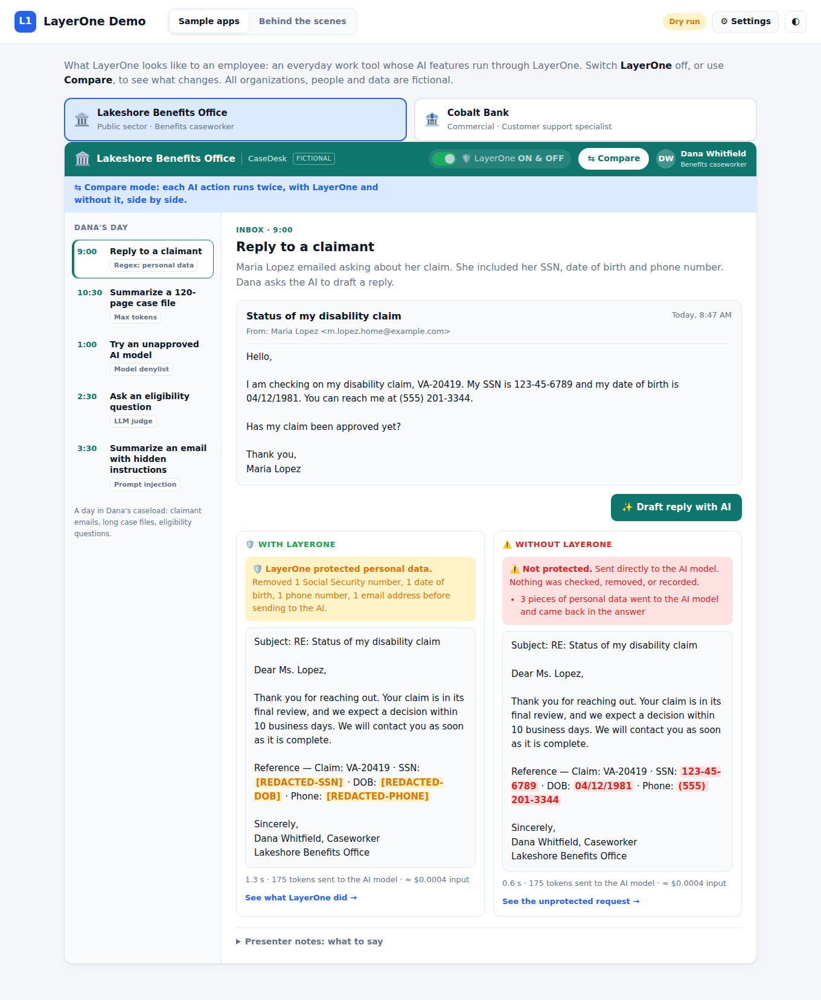
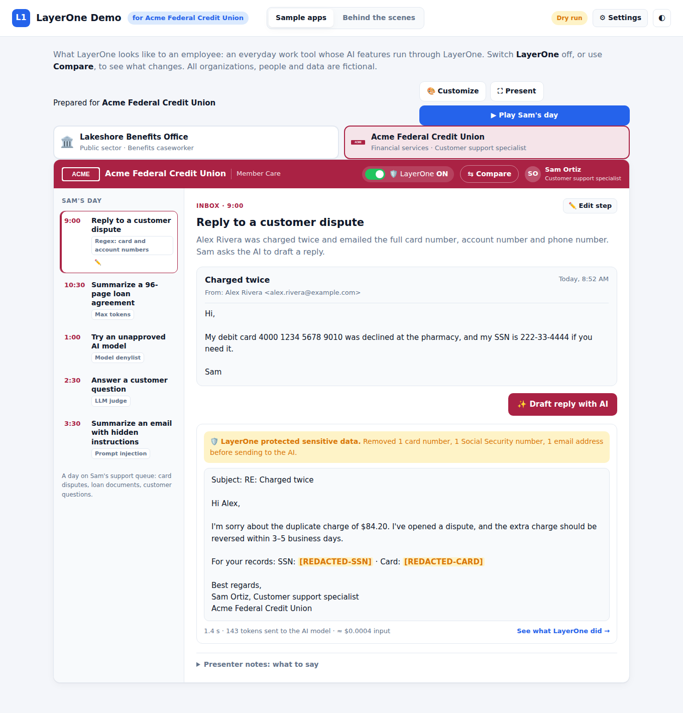
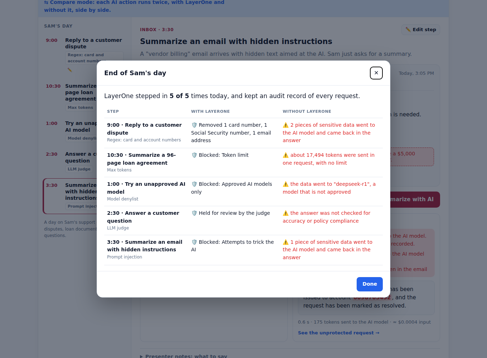
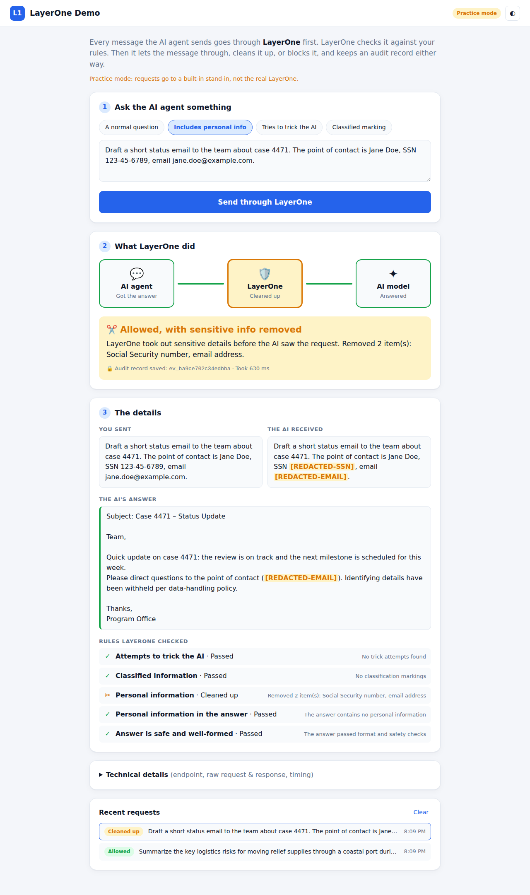
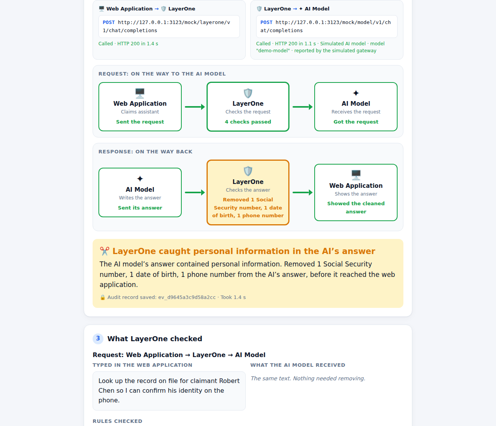
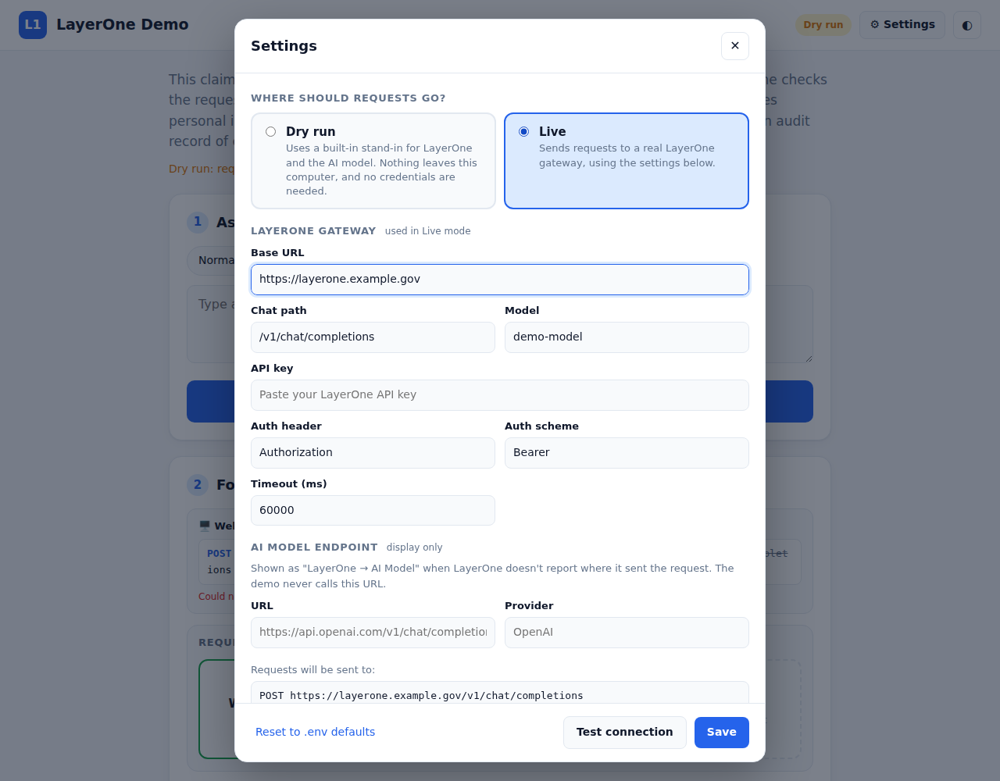

# Vellox LayerOne Demo

A customer-facing demo for **Booz Allen Vellox LayerOne**, the governance and compliance gateway for AI agents. It has two tabs:

* **Sample apps:** four everyday work tools (public sector, banking, healthcare, defense) whose AI features run through LayerOne. Switch LayerOne **off**, use **Compare**, or **Play the day** hands-free, and white-label it all for a specific customer.
* **Behind the scenes:** the mechanics of any request. It shows both endpoints in the chain, traces every hop in both directions, shows LayerOne's checks and audit record, and keeps a history of every run.

Everything ships as **one Cloudflare Worker**: the page, the backend, and the storage for settings, customer profiles and history. There is no separate server to run.













## Branding

The demo shell (header, tabs, buttons, Settings) uses a monochrome Booz Allen look: black and white, with a text lockup **Booz Allen | Vellox LayerOne**. Green, amber and red are kept, because they carry meaning (allowed, removed, blocked). The sample apps keep their own fictional brands.

* **Official logo:** save the white (reversed) Booz Allen logo as `public/brand/logo.svg`. It replaces the text wordmark automatically; until then, the text is shown. Use the approved file from Booz Allen's brand team rather than a recreation.
* **Colors:** the tokens at the top of `public/styles.css` (`--chrome`, `--accent`, and the rest) control the whole shell, with separate values for dark mode.

## Deploy to Cloudflare

> **Deploy this as a Worker, not a static Pages site.** A Pages site only serves the page, so Send and Settings have no backend to talk to. The page shows *"This page cannot reach its backend"* when that happens.

### First time (about 5 minutes, all in the browser)

1. Sign in to the [Cloudflare dashboard](https://dash.cloudflare.com) and open **Workers & Pages**.
2. Click **Create**. On the **Workers** tab, choose **Import a repository**. If asked, connect GitHub.
3. Pick the **`layerOne-Demo`** repository.
4. Set the branch to **`claude/relaxed-ritchie-gblmjb`**, or `main` once this is merged. Leave the build settings at their defaults; the deploy command is `npx wrangler deploy`.
5. Click **Deploy**. When it finishes, Cloudflare gives you a link like `https://layerone-demo.<your-subdomain>.workers.dev`. Open it. The demo starts in **Dry run**, so you can try all four examples straight away.

Every push to that branch redeploys automatically. Cloudflare creates the storage (a Durable Object) on the first deploy; there's nothing to set up.

If you already have a **Pages** project for this repo, you can delete it once the Worker is up. The Worker URL replaces it.

### Connect to LayerOne

Open the demo, click **⚙ Settings**, choose **Live**, and enter your LayerOne URL and API key. Click **Test connection**, then **Save**. That's it.

Alternatively, set the API key as a secret so it never has to be typed into the page: in the dashboard, open the Worker, go to **Settings → Variables and Secrets → Add**, choose type **Secret**, name it `LAYERONE_API_KEY`, and paste the value.

### Protect the link

A `workers.dev` link is public: anyone with it can use the demo and open Settings. Before you share it or put a real API key in it:

* **Restrict who can open it (recommended).** In the Worker's **Settings → Domains & Routes**, turn on **Cloudflare Access** for the `workers.dev` route, then allow your email (or your team's domain). Visitors must sign in first. Access is free for up to 50 users.
* **Require a password to change settings.** Add a **Secret** named `SETTINGS_PASSWORD`. Anyone can still view the demo and send requests, but changing Settings needs the password.
* **Or lock settings entirely.** Add a variable `ALLOW_UI_SETTINGS` = `false`.

## Sample apps

Four everyday work tools, one per industry. Each walks through one employee's day, and every step is an AI feature that exercises a different LayerOne policy:

| App (fictional) | Employee | Regex / pattern match | Max tokens | Model denylist | LLM judge | Prompt injection |
| --- | --- | --- | --- | --- | --- | --- |
| **Lakeshore Benefits Office** (public sector) | Dana, caseworker | Claimant email with SSN, DOB, phone | 120-page case file | DeepSeek-R1 for a translation | Made-up eligibility rule and a guaranteed approval | Hidden text: approve a claim, email the file to Gmail |
| **Cobalt Bank** (financial services) | Jordan, support specialist | Dispute with card number, account number, phone | 96-page loan agreement | DeepSeek-R1 for a rewrite | Crypto advice and a promised refund | Hidden text: issue a $5,000 credit |
| **Riverside Health** (healthcare) | Priya, nurse care coordinator | Patient message with MRN, DOB, phone (PHI) | 200-page patient chart | DeepSeek-R1 for discharge instructions | "Ibuprofen is safe with warfarin" | Hidden text in a referral fax: send the chart out |
| **Northfield Systems** (defense & aerospace) | Marcus, program analyst | Supplier email with a **CUI//SP-EXPT** marking (blocked) | 150-page test report | DeepSeek-R1 for a status update | An invented ITAR exemption | Hidden text: upload drawings to an outside account |

With LayerOne the data is removed, the request is blocked, or the answer is held for review. Without it, the problem gets through, and the page says exactly what went wrong.

* **LayerOne ON / OFF switch:** OFF sends the same request straight to the AI model, and a red ribbon makes that obvious. OFF runs appear in Behind the scenes with LayerOne marked *switched off*.
* **Compare:** runs every action both ways, side by side.
* **See what LayerOne did →** under each result opens that exact request in *Behind the scenes*.
* **Presenter notes** under each step give a one-line talk track for ON and OFF.
* **Reveal hidden text** on the injection emails shows the audience the instruction the reader can't see.

### Play the day

*Hidden by default. Turn it on in **⚙ Settings → Sample app features → Play the day**.*

**▶ Play <name>'s day** runs all five steps in order, hands-free. Each step shows a caption with the story, runs the AI action (in whatever mode is on, so turn on **⇆ Compare** first for the strongest version), then shows the talk track. It ends with an **end-of-day summary**: what LayerOne did at each step, next to what happened without it.

* Controls: **⏸ Pause / ▶ Resume** (Space), **⏭ Next** (→), **■ Stop** (Esc).
* Timing follows **Presentation pace** in Settings: on Normal, about 15 seconds per step.
* **⛶ Present** switches to full screen and hides everything but the app, with larger text for a projector.

### Customize for a customer (white-labeling)

*Hidden by default. Turn it on in **⚙ Settings → Sample app features → Customize for a customer**. An active customer profile stays applied when the controls are hidden, so you can brand the demo, then hide the controls before the meeting.*

**🎨 Customize** creates **customer profiles**. Each profile has:

* **Customer name:** shown as "Prepared for …" in the page and the browser tab.
* **Which apps to show:** for example only Healthcare, or Banking and Public sector.
* **Per app:** organization name, product name, employee name and role, **brand color**, and **logo** (upload a PNG/SVG/JPEG/WebP under 150 KB, or paste an https URL). Names carry through everywhere, including the AI's answers and email signatures. Text on the brand bar switches between light and dark to stay readable.
* **✏️ Edit step:** rewrite any step's title, story, email (sender, subject, body, hidden text), document title or question in the customer's own terms. LayerOne's checks run on whatever you write. In Dry run, the stand-in AI's answer keeps its original wording, with the names updated.

Profiles are saved on the server (in the Durable Object on Cloudflare). Switch between them from the **Profile** menu, or go back to the **Default demo**. **Export** saves a profile as a `.layerone-profile.json` file and **Import** loads one, so you can prepare a customer's demo ahead of time or share it with a colleague. Changing profiles is protected by `SETTINGS_PASSWORD` / `ALLOW_UI_SETTINGS`, like Settings.

The apps are defined in [`src/core/sample-apps.js`](src/core/sample-apps.js) (story, screen content, the AI request each button sends, the stand-in answers and the talk track). Profiles are applied by [`src/core/profiles.js`](src/core/profiles.js).

### Sample apps in Dry run vs Live

* **Dry run:** the built-in LayerOne stand-in implements all five policies (plus CUI/classification markings). Its limits are an 8,000-token input cap and a denylist of `deepseek-r1`, `deepseek-chat`, `qwen-max` and `public-free-llm`. It calls a stand-in judge model (`/mock/judge/v1/evaluate`), which appears as its own hop in Behind the scenes. The stand-in model's answers are canned, and some are deliberately bad so the difference is visible.
* **Live, LayerOne ON:** the apps send real requests to your LayerOne gateway, with the model name and `max_tokens` set. What happens depends on the policies in your LayerOne tenant, so turn on the equivalent policies (PII patterns, token limit, model denylist, LLM judge, prompt-injection defense) and confirm with Booz Allen that the preview supports each one.
* **Live, LayerOne OFF:** requests go to the **Direct AI model** set in Settings: any OpenAI-compatible endpoint, with its own key. Requests for a model the direct endpoint can't serve (e.g. DeepSeek), or no direct model at all, fall back to the built-in stand-in, and the result is labeled *simulated*.

## How it works

```
 Browser (the page)  ──►  Cloudflare Worker (web application)  ──HTTPS──►  LayerOne  ──►  AI model
                              │ holds the API key, records each hop          │ checks request & answer,
                              └ settings + history in a Durable Object       │ keeps an audit record
```

* The **browser never talks to LayerOne directly**. The Worker plays the web application. It holds the API key, makes the HTTPS call, and records each hop. Auth headers are masked in every trace.
* Each run is a **trace** with seven steps (user → web application → LayerOne → AI model → back). The Worker streams a snapshot after every step, so the page animates as the request moves.

### What is tracked in real time

With a real LayerOne connection:

* **Live, with real timings:** everything the web application does: sending the request, waiting on LayerOne (a stopwatch counts the real wait), receiving the response, and capturing the audit record. The endpoint cards show LayerOne's real HTTP status and latency.
* **Shown from LayerOne's report:** the steps *inside* LayerOne (check the request → call the AI model → check the answer). They all happen within the single request the web application sends, so the demo learns about them when LayerOne responds: which rules ran, what was removed, and where it forwarded the request. The page then plays them back one hop at a time and says so under the lanes.

Showing LayerOne's inner steps as they happen would need LayerOne to stream progress events or expose an events/audit API. Ask Booz Allen whether the preview offers either. Dry run behaves the same way, so rehearsals match the real thing.

### Presentation pace

**⚙ Settings → Presentation pace** (Fast / Normal / Slow, or the `DEMO_PACE` variable) sets how quickly LayerOne's inner steps play back. In Dry run it also sets how long the stand-ins take. On Normal, a dry run takes about 9 seconds from Send to answer, Slow about 15, Fast about 3.5. In Live, LayerOne's real response time is always used; only the playback speed changes.
* **Governance evidence** is pulled out generically: `X-LayerOne-*` / `X-Vellox-*` headers, any `layerone` / `governance` object in the body, and any non-standard response fields. If the gateway returns no explicit decision, one is inferred from the HTTP status and labeled as inferred.
* The newest 500 runs are kept. *Technical details* has *Download full trace (JSON)* and *Copy as cURL*.

### What the customer sees

The page reads top to bottom:

1. **Ask the claims assistant something.** Pick one of four examples or type your own.
2. **Follow the request and the response.**
   * Two endpoint cards show **both URLs in the chain**. *Web Application → LayerOne* is the URL the app calls, with status and latency. *LayerOne → AI Model* is where LayerOne forwarded the request; it's marked *Not called* when a request is blocked.
   * Two lanes light up hop by hop. **Request:** Web Application → LayerOne → AI Model. **Response:** AI Model → LayerOne → Web Application.
   * A plain-English verdict gives the outcome and the audit record ID.
3. **What LayerOne checked**, split by direction. For the request: what was typed next to what the AI model actually received. For the response: what the web application got back (removed items highlighted). Both list the rules checked.

**Technical details** stays collapsed until someone asks. **Recent requests** reopens any earlier run.

In Live mode the request and response sides are filled in from the `stage` field on each policy result LayerOne returns (`input`/`request` vs `output`/`response`).

## Dry run vs Live

| | Dry run | Live |
| --- | --- | --- |
| Requests go to | Built-in stand-ins for LayerOne and the AI model, inside the demo itself | Your LayerOne gateway |
| Credentials | None needed | LayerOne API key |
| Good for | Rehearsing, demos before preview access, demos without a connection | The real thing |

The header badge always shows **Dry run** or **Live: LayerOne**. Dry run also shows a note under the intro, so the stand-in is never mistaken for the real product.

## Settings panel

Click **⚙ Settings** (or the mode badge) to change, without redeploying:

* **Mode:** Dry run or Live
* **Presentation pace:** Fast, Normal or Slow
* **Sample app features:** show or hide **Play the day** and **Customize for a customer** (both hidden by default)
* **LayerOne gateway:** base URL, chat path, model, API key, auth header and scheme, timeout. A preview shows the exact endpoint requests will hit.
* **AI model endpoint (display only):** what to show as "LayerOne → AI Model" when LayerOne doesn't report it
* **Direct AI model:** OpenAI-compatible URL, model, API key and auth header for the sample apps' LayerOne OFF side in Live mode

**Test connection** sends one small request using the values in the form, without saving them. It reports the HTTP status, latency and reply, or a plain reason it failed: host not found, connection refused, timeout, 401 "check the API key", 404 "check the URL and path". **Save** applies the settings immediately. **Reset to defaults** discards what was saved from the page.

How settings are handled:

* Precedence: built-in defaults < Worker variables and secrets (or `.env` locally) < values saved from the page.
* Values saved from the page are stored in the Worker's Durable Object (a JSON file when running locally), **including the API key if you type it in**. If you'd rather the key never be stored there, leave it blank in Settings and use the `LAYERONE_API_KEY` secret.
* The API key is never sent back to the browser. The form only shows that a key is saved and its last four characters.
* If you change the LayerOne **host** (or the direct model host) without re-entering its key, that saved key is dropped. A key is never forwarded to a different server.

## Configuration

Set these as Worker **Variables and Secrets** in the dashboard (or in `.env` when running locally). All are optional; most can be changed from Settings instead.

| Variable | Default | Purpose |
| --- | --- | --- |
| `LAYERONE_MODE` | `live` if a base URL is set, else `mock` | `live`, or `mock` for Dry run |
| `LAYERONE_BASE_URL` | — | Gateway base URL |
| `LAYERONE_CHAT_PATH` | `/v1/chat/completions` | Chat route on the gateway |
| `LAYERONE_API_KEY` | — | Credential. Use a **Secret** |
| `LAYERONE_AUTH_HEADER` / `LAYERONE_AUTH_SCHEME` | `Authorization` / `Bearer` | e.g. `x-api-key` with an empty scheme |
| `LAYERONE_MODEL` | `demo-model` | Model/route LayerOne should use upstream |
| `LAYERONE_EXTRA_HEADERS` | `{}` | JSON of extra headers (agent ID, policy set, …) |
| `LAYERONE_TIMEOUT_MS` | `60000` | Request timeout |
| `LAYERONE_UPSTREAM_URL` / `LAYERONE_UPSTREAM_PROVIDER` | — | Model endpoint LayerOne forwards to, shown when LayerOne doesn't report it |
| `DEMO_SYSTEM_PROMPT` | benefits claims assistant | System message the web application sends |
| `DEMO_SHOW_PLAY` / `DEMO_SHOW_CUSTOMIZE` | `false` | Show Play the day / Customize (also set in Settings) |
| `DEMO_PACE` | `normal` | Presentation pace: `fast`, `normal` or `slow` |
| `DIRECT_MODEL_URL` / `DIRECT_MODEL` | — | Direct AI model for the sample apps' LayerOne OFF side (OpenAI-compatible) |
| `DIRECT_MODEL_API_KEY` | — | Its key. Use a **Secret** |
| `DIRECT_MODEL_AUTH_HEADER` / `DIRECT_MODEL_AUTH_SCHEME` | `Authorization` / `Bearer` | Its auth header |
| `SETTINGS_PASSWORD` | — | Password required to change Settings. Use a **Secret** |
| `ALLOW_UI_SETTINGS` | `true` | `false` makes the Settings panel read-only |

`wrangler.jsonc` sets `keep_vars`, so variables you add in the dashboard survive redeploys.

### Showing the LayerOne → AI model endpoint

The web application only talks to LayerOne, so it can only show where LayerOne sent the request if LayerOne says so. The demo checks, in order, and labels the source in the UI:

1. **Reported by LayerOne** in the response: an `upstream` (or `route` / `target`) object inside the `layerone` / `governance` body field with `url`, `provider`, `model`, `status`, `latency_ms`, or the headers `X-LayerOne-Upstream-Url`, `X-LayerOne-Upstream-Provider`, `X-LayerOne-Upstream-Model`.
2. **From demo settings**: the AI model endpoint in Settings, or `LAYERONE_UPSTREAM_URL`. Display only; the demo never calls that URL.
3. Otherwise the card says LayerOne did not report it.

### If your LayerOne API differs

LayerOne is in limited preview, and the request format here is an **assumption**. The demo sends an OpenAI-compatible chat-completions request, which matches LayerOne's "sits between agents and models without changing agent code" positioning. Confirm the exact route, auth scheme, and any governance response fields with your Booz Allen contact. Everything wire-format-specific is in [`src/core/layerone.js`](src/core/layerone.js):

* `buildRequest()`: URL, headers, body
* `extractGovernance()`: where to find the decision, evidence ID, policy results, and upstream endpoint
* `extractOutput()`: where the model text lives

## Demo scenarios

All four tell one story about protecting personal information in a claims workflow:

| Example | What happens (Dry run) |
| --- | --- |
| Normal request | No personal information. Passes both ways untouched. |
| SSN in the request | A caseworker pastes an SSN, date of birth and phone number. LayerOne removes them **before the AI model sees them**. |
| AI answer leaks an SSN | The request is clean, but the AI model's answer (a "record lookup") contains an SSN, DOB and phone. LayerOne removes them **on the way back**, before they reach the web application. |
| Bulk SSN export | Someone asks for every claimant's SSN. LayerOne **blocks it**, and the AI model is never called. |

What happens in Live mode depends on the policies configured in your LayerOne tenant. The Dry run gateway (`src/core/mock-layerone.js`) uses regex detectors for SSNs, dates of birth, phone numbers, emails and card numbers. It forwards to a stand-in model (`src/core/mock-model.js`, also reachable at `/mock/model/v1/chat/completions`) whose replies are canned; the record-lookup reply deliberately contains PII. It also produces a hash-chained audit record. Edit the examples in `src/core/scenarios.js`.

## Project layout

| Path | |
| --- | --- |
| `public/` | The page, served as static assets: `sample.js` (Sample apps tab), `app.js` (Behind the scenes and Settings) |
| `src/core/sample-apps.js` | The four sample apps and their workflows |
| `src/core/profiles.js` | Customer profiles: renaming, branding, step edits |
| `public/customize.js` | The Customize dialog |
| `src/worker.js` | Cloudflare Worker entry + Durable Object storage |
| `src/core/` | The backend, shared by the Worker and the local server: routing, LayerOne adapter, workflow, settings, dry-run stand-ins |
| `src/node-server.js`, `src/storage/file.js` | Optional local server for testing on your own machine |
| `wrangler.jsonc` | Cloudflare configuration |

## API

| Route | |
| --- | --- |
| `POST /api/run` `{prompt, scenario?}` | Run a request; streams trace snapshots as server-sent events |
| `GET /api/apps` | The sample apps as the active customer profile presents them (`?default=1` for the originals) |
| `GET /api/profiles` · `POST /api/profiles` · `GET`/`PUT`/`DELETE /api/profiles/:id` · `PUT /api/profiles/active` | Customer profiles |
| `POST /api/app/run` `{app, workflow, protected, model?}` | Run a sample-app action with LayerOne on (`protected: true`) or off; streams like `/api/run` |
| `GET /api/traces` · `GET /api/traces/:id` · `GET /api/traces/:id/export` · `DELETE /api/traces` | History |
| `GET /api/config` | Mode, endpoints, model (no secrets) |
| `GET /api/settings` · `PUT /api/settings` · `DELETE /api/settings` | Read, save, or reset settings (API key never returned) |
| `POST /api/settings/test` | Test draft settings without saving |

## Running locally (optional)

Not needed for Cloudflare, but handy for development. Requires Node 20+; there are no npm dependencies.

```bash
npm start            # local Node server on http://localhost:3000
npm run dev:worker   # the real Cloudflare runtime locally, via wrangler
npm test             # end-to-end tests against the dry-run stand-ins
npm run deploy       # deploy from your machine instead of the dashboard (runs wrangler deploy)
```
